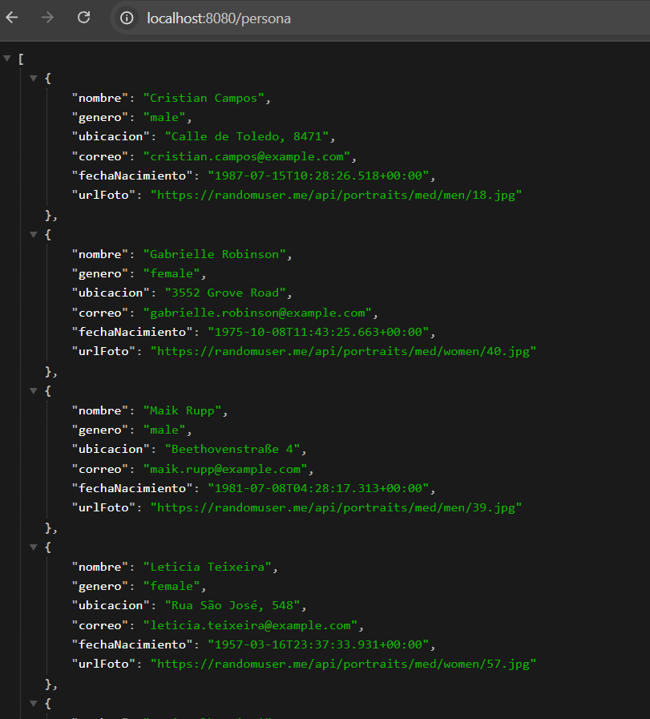
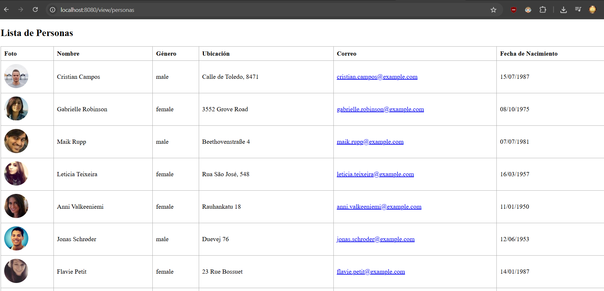

# NNTretoTecnico
Reto técnico de NNT

## Tecnologías utilizadas

- Java 21
- Maven
- Spring Boot
- Thymeleaf

## Endpoints principales

### Personas
- `GET /persona`  
  Obtienes 10 personas random generadas por la página https://randomuser.me/api/?results=10  
  

### Vistas
- `GET /view/personas`  
  Lista todas las personas obtenidas del endpoint anterior y las muestra en una tabla.  
  

## Cómo ejecutar

1. **Clonar el repositorio**
    ```bash
    git clone https://github.com/devi96/NNTretoTecnico.git
    cd NNTretoTecnico
    ```

2. **Construir el proyecto**
    ```bash
    mvn clean install
    ```

3. **Ejecutar la aplicación**
    ```bash
    mvn spring-boot:run
    ```

4. **Probar los endpoints**

    - Para obtener las personas en formato JSON (datos crudos):  
      Accede a `http://localhost:8080/persona`  

    - Para ver la vista con la tabla de personas:  
      Accede a `http://localhost:8080/view/personas`  

## Notas
- Actualmente las personas son generadas consumiendo el servicio https://randomuser.me/api/?results=10.
- Se pueden hacer mejoras como guardar la información en una base de datos o consumir los servicios de RandomUser con `RestTemplate` para un mejor manejo y cacheo de datos.